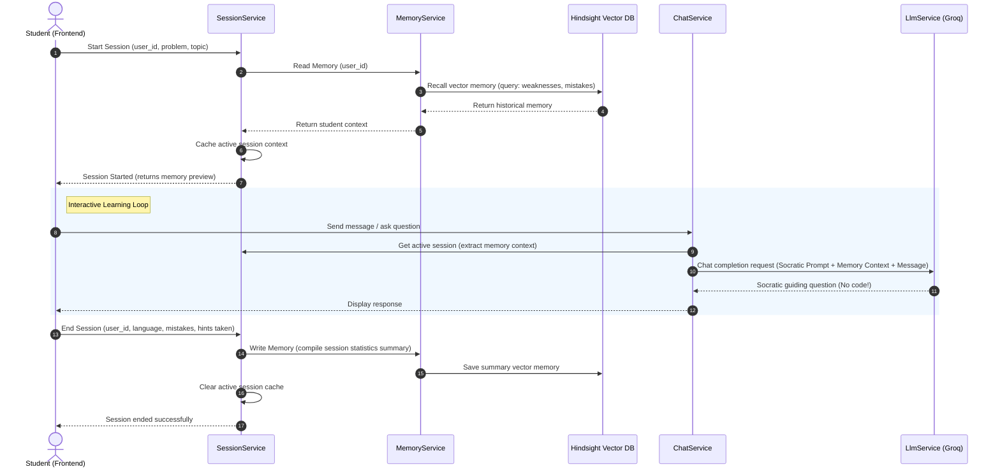
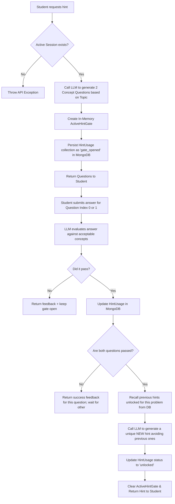
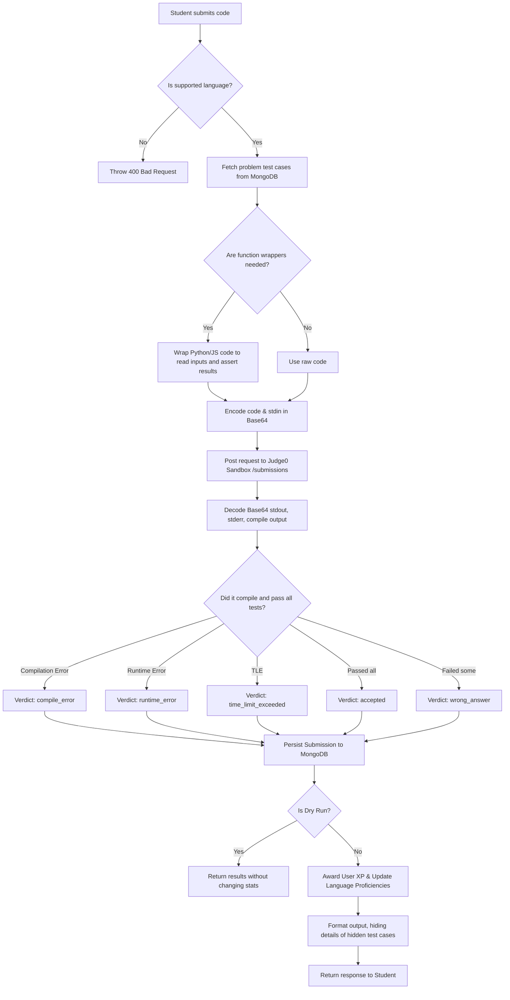

# Hindsight Backend 🧠

Welcome to the backend service of **Hindsight**, a powerful Spring Boot application designed to support two distinct domains: a **Gamified AI-Gated Socratic Coding Platform** and a **Police Station Crime & SOS Analytics Dashboard**. 

This system integrates advanced LLMs, vector memory storage, and sandboxed code execution to deliver a highly interactive educational experience alongside real-time analytical capabilities.

---

## 🏗️ Architecture & Modules Overview

The codebase is organized following standard Spring Boot patterns, split cleanly into separate layers for configuration, controllers, services, repositories, models, and DTOs.

```
src/main/java/com/hindsight/backend/
├── HindsightApplication.java        # Spring Boot Application Entry Point
├── config/                         # Configuration beans (Security, WebClient, WebSockets)
├── security/                       # JWT authentication filters and providers
├── controller/                     # REST API Controllers (endpoints)
├── service/                        # Business logic services
├── repository/                     # MongoDB Spring Data Repositories
├── model/                          # Database entities / collections
├── dto/                            # Data Transfer Objects for API requests/responses
└── util/                           # Utilities & prompts (Constants)
```

### 1. Configuration & Security Module
*   [WebClientConfig.java](file:///c:/Users/Rohith%20S%20D/OneDrive/Documents/SpringBackend/src/main/java/com/hindsight/backend/config/WebClientConfig.java): Configures `WebClient` instances for external integrations (Hindsight API, Groq, Judge0, and Gemini).
*   [SecurityConfig.java](file:///c:/Users/Rohith%20S%20D/OneDrive/Documents/SpringBackend/src/main/java/com/hindsight/backend/config/SecurityConfig.java) & [security/](file:///c:/Users/Rohith%20S%20D/OneDrive/Documents/SpringBackend/src/main/java/com/hindsight/backend/security): Implements stateless JWT authentication. All requests under `/api/v1/**` (except `/api/v1/auth/**`) are authenticated via the [JwtAuthenticationFilter](file:///c:/Users/Rohith%20S%20D/OneDrive/Documents/SpringBackend/src/main/java/com/hindsight/backend/security/JwtAuthenticationFilter.java).
*   [WebSocketConfig.java](file:///c:/Users/Rohith%20S%20D/OneDrive/Documents/SpringBackend/src/main/java/com/hindsight/backend/config/WebSocketConfig.java): Registers WebSocket endpoints to enable real-time messaging capabilities.

### 2. Socratic Coding Tutor & Gamification Module
This module runs the interactive coding workspace, mentoring students without revealing answers directly.
*   **Sessions**: [SessionController](file:///c:/Users/Rohith%20S%20D/OneDrive/Documents/SpringBackend/src/main/java/com/hindsight/backend/controller/SessionController.java) & [SessionService](file:///c:/Users/Rohith%20S%20D/OneDrive/Documents/SpringBackend/src/main/java/com/hindsight/backend/service/SessionService.java) track the active problem a user is attempting.
*   **Memory Bank (Hindsight)**: [MemoryService](file:///c:/Users/Rohith%20S%20D/OneDrive/Documents/SpringBackend/src/main/java/com/hindsight/backend/service/MemoryService.java) connects to Hindsight's vector memory system to store session summaries (weaknesses, mistakes, hints) and recall them upon starting a new session.
*   **Socratic Mentoring Chat**: [ChatController](file:///c:/Users/Rohith%20S%20D/OneDrive/Documents/SpringBackend/src/main/java/com/hindsight/backend/controller/ChatController.java) & [ChatService](file:///c:/Users/Rohith%20S%20D/OneDrive/Documents/SpringBackend/src/main/java/com/hindsight/backend/service/ChatService.java) implement dialogue flow where the LLM behaves as a guide, referencing historical student weaknesses to contextually nudge them.
*   **Hint Gating**: [HintController](file:///c:/Users/Rohith%20S%20D/OneDrive/Documents/SpringBackend/src/main/java/com/hindsight/backend/controller/HintController.java) & [HintService](file:///c:/Users/Rohith%20S%20D/OneDrive/Documents/SpringBackend/src/main/java/com/hindsight/backend/service/HintService.java) handle "Hint Gates". To earn a hint, students must answer two conceptual questions generated on the fly. The answers are graded by the LLM before releasing a hint.
*   **Sandbox Code Execution**: [JudgeService](file:///c:/Users/Rohith%20S%20D/OneDrive/Documents/SpringBackend/src/main/java/com/hindsight/backend/service/JudgeService.java) and [SubmissionService](file:///c:/Users/Rohith%20S%20D/OneDrive/Documents/SpringBackend/src/main/java/com/hindsight/backend/service/SubmissionService.java) run and test student code against test cases using the remote Judge0 sandbox.
*   **Gamification Stats**: [UserStatsController](file:///c:/Users/Rohith%20S%20D/OneDrive/Documents/SpringBackend/src/main/java/com/hindsight/backend/controller/UserStatsController.java) & [UserStatsService](file:///c:/Users/Rohith%20S%20D/OneDrive/Documents/SpringBackend/src/main/java/com/hindsight/backend/service/UserStatsService.java) manage user XP, level tiers (`Beginner`, `Intermediate`, `Advanced`, `Expert`), activity streaks, and personalized recommendations.

### 3. Police SOS & Analytics Module
A specialized analytics track handling public safety telemetry.
*   **SOS Alerts**: [SosController](file:///c:/Users/Rohith%20S%20D/OneDrive/Documents/SpringBackend/src/main/java/com/hindsight/backend/controller/SosController.java) & [SosService](file:///c:/Users/Rohith%20S%20D/OneDrive/Documents/SpringBackend/src/main/java/com/hindsight/backend/service/SosService.java) manage dispatching emergency alerts, determining proximity to police stations, and broadcasting updates.
*   **Analytics Chat & Trend Synthesis**: [AnalyticsController](file:///c:/Users/Rohith%20S%20D/OneDrive/Documents/SpringBackend/src/main/java/com/hindsight/backend/controller/AnalyticsController.java) triggers Gemini AI to synthesize incidents, stations, and SOS telemetry into police briefs.

---

## 🔄 Core Workflows Explained

### 1. The Socratic Coding Session Workflow



1.  **Start Session**: A student selects a coding problem. The server reads past memories of the user's weaknesses (e.g., struggling with array index bounds, missing hashmap edge cases) from the Hindsight API and stores it in the active session.
2.  **Socratic Dialog**: The student communicates with the AI chatbot. The chatbot uses `Constants.SOCRATIC_SYSTEM_PROMPT` merged with the student's recalled weaknesses. If the student asks for code, the system gently refuses and prompts them to think about the next step.
3.  **End Session**: Upon finishing, the frontend sends a summary of mistakes and hints. The server constructs a session log, stores it in Hindsight's vector database, and deletes the in-memory active session.

---

### 2. The Hint Gating Workflow

To prevent students from relying on hints without thinking, the platform gates hints behind conceptual validation:



---

### 3. Code Submission & Execution Flow



---

### 4. Emergency SOS & Police Analytics Workflow

1.  **SOS Alert Broadcast**:
    *   Devices submit SOS coordinates via `SosController`.
    *   The `SosService` parses the location, computes proximity to the nearest police stations, and dispatches real-time alerts.
2.  **Gemini Crime Synthesis**:
    *   A background scheduler regularly fetches active incident reports, SOS logs, and station distributions.
    *   The frontend can request analytical insights. The system feeds this data to **Gemini 1.5 Pro** using a specialized police prompt to generate structured bulleted insights (with emojis) detailing active crime hubs, correlation between SOS alerts, and resource allocation instructions.

---

## 🔌 API Integration Matrix

The backend relies on four external APIs, configured in [application.properties](file:///c:/Users/Rohith%20S%20D/OneDrive/Documents/SpringBackend/src/main/resources/application.properties):

| API Endpoint | Config Property | Service | Usage |
| :--- | :--- | :--- | :--- |
| **Hindsight Vector memory** | `hindsight.endpoint` | `MemoryService` | Vectorized memory storage and retrieval of student historical weaknesses and session summaries. |
| **Groq LLM** | `groq.url` | `LlmService` | Performs high-speed Socratic mentoring conversations and hint gate grading using `llama-3.3-70b-versatile`. |
| **Judge0 Sandbox** | `judge0.url` | `JudgeService` | Sandboxed multi-language remote compiler and runner for testing and grading user submissions. |
| **Gemini AI** | `gemini.url` | `AnalyticsService` | Evaluates public safety data and performs incident trend synthesis using `gemini-1.5-pro`. |

---

## 🛠️ Getting Started

### Prerequisites
*   **Java 17** installed.
*   **MongoDB** running locally on port `27017` (or configured in environment variables).
*   API keys for Groq, Gemini, and Hindsight.

### Environment Setup
Create a `.env` file or export the following environment variables:
```bash
SPRING_DATA_MONGODB_URI=mongodb://localhost:27017/hindsight_hackathon
JWT_SECRET=your_super_secure_jwt_secret_key_here
GROQ_API_KEY=your_groq_api_key
HINDSIGHT_API_KEY=your_hindsight_api_key
GEMINI_API_KEY=your_gemini_api_key
```

### Running the Application
Using the Maven wrapper, compile and run the backend:
```powershell
./mvnw clean spring-boot:run
```
The server will start on port `9090` (configured in `application.properties`).
